# 인도네시아 이커머스 플랫폼 개선 프로젝트

 

- 분석 기간 : 2023.06.07 ~ 2023.07.04
- 4인 프로젝트
- 기술스택

|Programming & Markup Language|__Python__|
|:--------:|:-------:|
|__IDE & Environment__|__VSCode__|
|__Database & Cloud DB__|__Google Drive__|
|__Model__|__Logistic Regression, XGBoost, Decision Tree, Random Forest, CatBoost__|

 

### <목차>
1. 프로젝트 개요
2. 프로젝트 수행절차   
   2.1 데이터 소개   
   2.2 EDA   
   2.3 문제정의   
   2.4 결과   
   2.5 이탈 예측 모델   
4. 한계점 및 개선사항

 

#### 1. 프로젝트 개요
1.1 프로젝트 배경
- Fashion Campus는 15-35세의 젊은 층인 "Indonesian Young Urbans"의 시장 점유율을 보유한 전자 상거래 패션 회사입니다. 젊은 세대들에게 사랑받는 국내외 브랜드의 제품을 제공하며 10,000명의 고객을 확보하고, 매달 100,000건 이상의 구매가 이뤄지고 있습니다. 하지만 유기적이지 않은
사용자 수의 영향으로 인해 사용자들이 거래를 위해 플랫폼으로 돌아오지 않았고, 이탈률이 높아졌습니다. 이를 해결하고 이탈 예측하고자 합니다.

1.2 프로젝트 목표
- Fashion Campus의 현황을 파악하여 문제진단, 액션 도출
- 이탈 원인을 파악하고 이탈 예측 모델 개발
  
 

#### 2. 프로젝트 수행절차   
2.1 데이터 소개  
<table>
  <tr>
    <td>
      
    </td>
    <td>     
        
<customer 데이터>

        
- 100,000 rows X 15 columns  
 
        
- Fashion Campus에 가입한 고객들의 데이터
   
        
- 고객 ID와 성별, 나이, 디바이스 운영체제, 거주지, 가입날짜 등에 대한 정보 제공
   
    </td>
  </tr>
  <tr>
    <td>
      
    </td>
    <td>     
      
<product 데이터>

      
- 44,424 rows X 10 columns
 
      
- Fashion Campus에서 판매되는 제품에 대한 데이터
   
      
- 제품 ID, 성별, 카테고리, 출시연도, 계절 등에 대한 정보 제공
   
    </td>
  </tr>
    <tr>
    <td>
      
    </td>
    <td>     
      
<click_stream_new 데이터>

      
- 12,833,602 rows X 12 columns
 
      
- 신규 가입 후 세션을 활성화하거나 제품 주문을 한 고객들의  로그 데이터 
   
      
- 세션 ID, 이벤트 네임과 시간, 구매 시 사용 기기 등에 대한 정보 제공
   
    </td>
  </tr>
    <tr>
    <td>
      
    </td>
    <td>     
      
<transaction_new 데이터>

      
- 1,254,585 rows X 16 columns
 
      
- Fashion Campus에서 고객이 구매한 것에 대한 정보를 제공해 주는 구매 데이터
   
      
- 주문 일자, 고객 ID, 예약 ID, 세션 ID, 프로모션 코드, 결제 성공 여부, 배송비, 배송 제한 날짜, 결제 금액 등에 대한 정보 제공
   
    </td>
  </tr>
</table>

 

2.2 EDA  
* 결측치 & 이상치
   * transaction_new, click_stream_new, product 데이터의 NaN 값과 수치형 변수(배송비, 제품 가격, 총합 등)의 Outlier 존재하지만, 
삭제 시 고객이 주문한 상품에 대한 정보를 파악할 수 없어서 그대로 유지 후 분석    
<table>
  <tr>
    <td>
      
       
<총합 outlier>

    </td>
    <td>     
        
       
<배송비 outlier>

    </td>
  </tr>
</table>

* 데이터 처리시 주의 사항
   * transaction_new의 경우 각 행에 고객의 구매 내역을 제품별로 기록한 데이터. 하지만 총합의 경우 모든 행에 동일한 값으로 입력되어 있어서 이를 인지하지 않고 그대로 사용하면 잘못된 정보를 얻게 될 수 있기 때문에 주의 필요

<table>
  <tr>
    <td>
      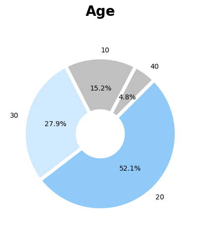
       
<연령층>

          
15-35세가 주요 연령층인 만큼 20대가 52%

    </td>
    <td>     
        
       
<성별>

      
여성 64%, 남성 36%

    </td>
   <td>     
        
       
<거주지 분포>

          
인도네시아 전 지역에 고루 분포

    </td>
  </tr>
 <tr>
    <td>
      
       
<결제방식>

          
많이 사용하는 방식으로는 신용카드 35%, Gopay & OVO 20% 

    </td>
    <td>     
      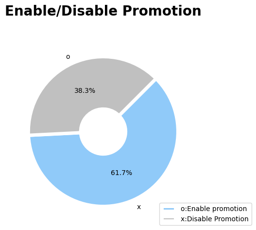  
       
<프로모션 적용 여부>

          
적용하지 않는 경우가 61.7%로 고객들이 프로모션을 잘 사용하지 않고 있음

    </td>
   <td>     
       
       
<계절별 상품비율>

          
여름 제품 48%, 가을 제품 26% 순으로 많음

    </td>
  </tr>
 <tr>
    <td>
      
       
<성별에 따른 상품>

          
여성이 64%로 많지만 남성 제품이 약 50%로 가장 많음

    </td>
    <td>     
        
       
<상품 스타일>

          
인도네시아 특성상 캐주얼 제품이 78%로 가장 많음

    </td>
    <td>     
       
       
<상품 카테고리>

          
Apparel이 49.2%로 가장 많이 차지

    </td>
  </tr>
 <tr>
    <td>
      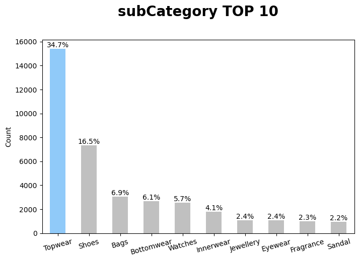
       
<세부 카테고리>

          
Topwear(34.7%), shoes(16.5%) 순으로 가장 많이 차지

    </td>
    <td>     
        
       
<형식 카테고리>

          
Tshirts (15.9%) 가 가장 많이 차지

    </td>
  </tr>
</table>

* 세션 재정의
   * 인도네시아 타 이커머스 플랫폼의 평균 체류시간은 평균 3분에서 6분 정도. 하지만 현 이커머스 플랫폼의 평균 체류 시간이 10일    이상이고, 이를 이상치로 판단하여 세션 재정의 진행
   * 30분 이상 동작이 존재하지 않으면 다른 세션으로 정의(세션 수 5,904,346개로 기존보다 약 10.7배 증가)
   * 평균 체류 시간 : 2분 26초
   * 구매 전환율 : 8.61%
<table>
  <tr>
    <td>
      
       
<시간별 구매전환율>

          
오후 3시이후부터 오전 5시이전까지 높은 구매전환율

    </td>
    <td>     
        
       
<월별 구매전환율>

      
7월에 높은 구매전환율

    </td>   
</table>  

- 신규 가입자의 유입 : 매년 신규 가입자가 꾸준히 증가하고 7월에 폭발적인 신규 가입자가 유입되고 있음.
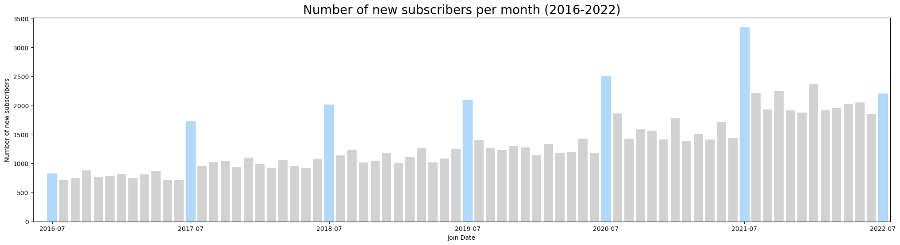

- 매출의 감소 : 꾸준히 상승세였던 매출이 2022년 6월과 7월, 2개월 연속으로 감소함.
   - 전월 대비 7월 감소율 ▼11.67% ( 전월 대비 6,7월 총 감소율 ▼16.26%)
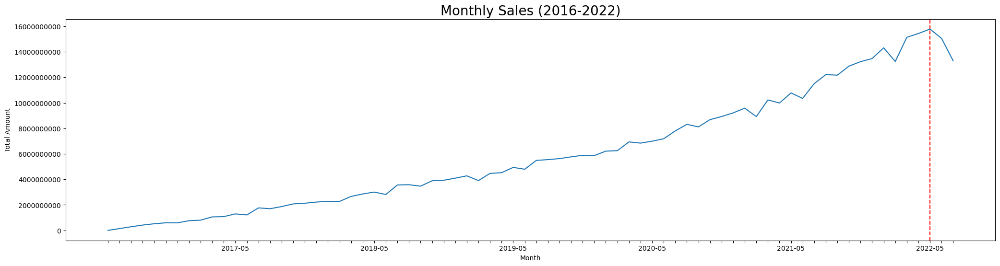

 

2.3 문제정의   
* **최근 2개월 연속 매출하락**이라는 문제를 정의했고, 3가지 내부 요인을 찾을 수 있었음.

1. 일회성 고객의 증가
<table>
  <tr>
    <td>
      
       
<연도별 비활성 고객 비율>

    </td>
    <td>     
       
       
<연도별 재구매율>

    </td>
</tr>
</table>  
          
* 최근 2개월 연속 매출 하락으로 인해 비활성 고객 비율 조사 결과, 가입연도가 2021년, 2022년인 경우 비활성 고객률이 53.1%, 59.5%를 차지했고, 재구매율 또한 계속 상승하다가 2022년 하락.
* 꾸준히 고객 유입이 있음에도 불구하고 매출의 하락과 비활성 고객율이 증가하였음. 재구매율의 하락을 통해 일회성 고객이 증가하고 있는지에 대한 의문 제기.

<table>
  <tr>
    <td>
      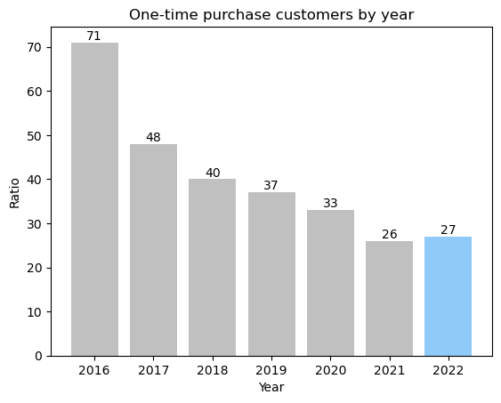
       
<연도별 일회성 고객 비율>

    </td>
    <td>     
      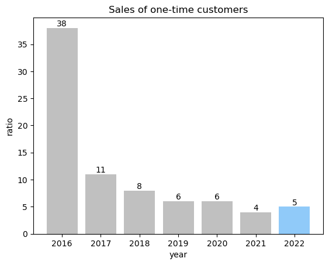 
       
<연도별 일회성 고객의 매출>

    </td>   
</table>  

* 일회성 고객률이 하락하고 있었지만,  유지 또는 상승하는 경향으로 바뀐 2022년 시점에서 매출이 감소함을 확인하고 일회성 고객의 유지 또는 증가하는 경향성이 영향을 주었다고  생각되어 일회성 고객을 충성고객으로 전환시킬 필요가 있다고 판단
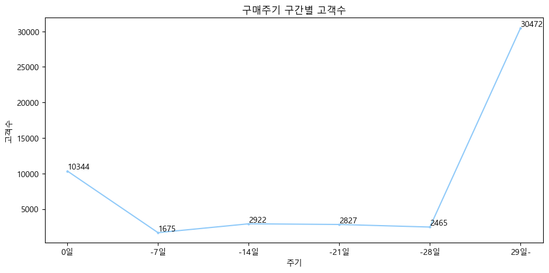

* 한 번도 구매하지 않은 고객을 제외한 후(50,705명), 고객별 평균 구매주기를 봤을 때 당일에 구매 후 이탈하는 고객이 20%, 29일 이후로 구매하는 고객이 60%를 차지. 이 그래프를 통해서도 일회성 고객을 더 세부적으로 분석해 볼 필요가 있다고 판단
* 일회성 고객의 특징
<table>
  <tr>
    <td>
      
      
<일회성 고객의 구매 상품 카테고리>

    </td>
    <td>
      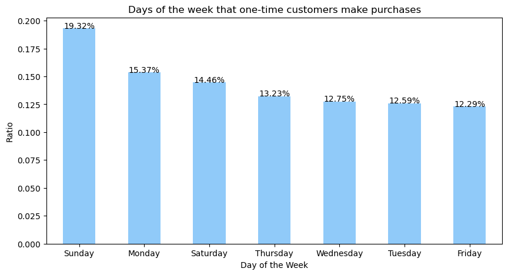
      
<일회성 고객의 구매 요일>

    </td>
  </tr>
  <tr>
    <td colspan="2">
      
<일회성 고객의 특징 1>

      
일회성 고객의 특징 1
        주로 구매하는 제품은 Apparel(48%), Accessories(25%), Footwear(20%) 순으로 많이 구매
        일회성 고객들은 일, 월, 토 순으로 구매
  
    </td>
  </tr>
 <tr>
    <td colspan="2">
      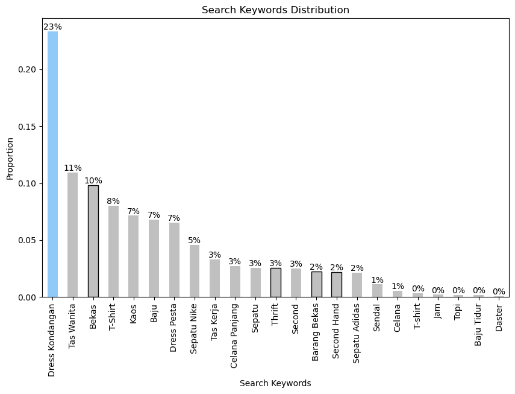
       
<일회성 고객의 전체 검색 비율과 중고 검색에 대한 비율>

    </td>
  </tr>
  <tr>
    <td colspan="2">
      
<일회성 고객의 특징 2>

      
Dress Kondangan(이슬람 전통복장)에 대한 검색 비율 35%, 중고에 대한 검색은 약 17% 정도
 
    </td>
  </tr>
  <tr>
    <td colspan="2">
      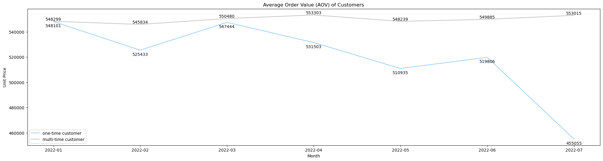
       
<2022년 월별 일회성 고객과 다회성 고객의 객단가 비교 그래프>

    </td>
  </tr>
  <tr>
    <td colspan="2">
      
<일회성 고객의 특징 3>

      
 2022년 기준 매출이 하락했던 6월~7월에는 일회성 고객의 객단가가 다른 월과 비교했을 때 낮고, 
그중 7월이 가장 낮음
   
    </td>
  </tr>
  <tr>
    <td>
      
      
<2022년 일회성 고객의 프로모션 사용 여부>

    </td>
    <td>
      
      
<2022년 다회성 고객의 프로모션 적용 여부>

    </td>
  </tr>
  <tr>
    <td colspan="2">
      
일회성 고객의 특징 4

      
일회성 고객 프로모션 사용 비중을 확인했을 때, 사용하지 않는다가 63.5% 차지.
        추가로 다회성 고객 또한 68.3%로 프로모션을 사용하지 않음

    </td>
  </tr>
         
<tr>
    <td>
      
      
<일회성 고객의 나이대 분포>

    </td>
    <td>
      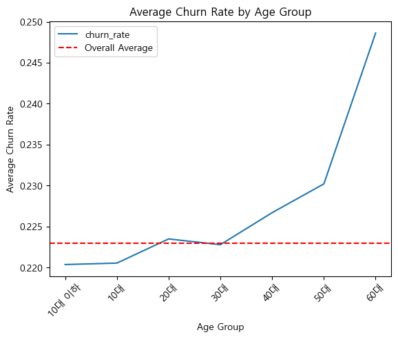
      
<나이별 평균 이탈율>

    </td>
  </tr>
  <tr>
    <td colspan="2">
      
일회성 고객의 특징 5

      
20대가 51%로 가장 많이 차지하며, 나이가 적고 많을수록 이탈률이 낮음

    </td>
  </tr>

   <tr>
    <td>
      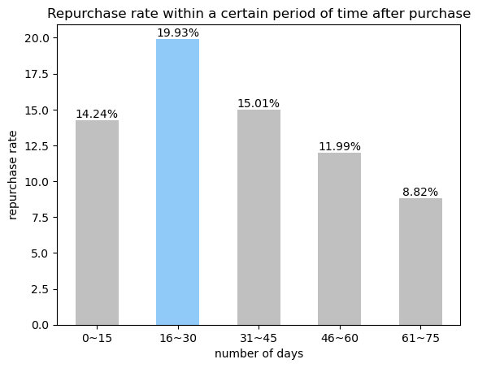
      
<고객의 재구매율>

    </td>
    <td>
      
      
<프로모션 적용 여부에 따른 고객의 재구매율>

    </td>
  </tr>
  <tr>
    <td>
      
이커머스 평균 재구매 기간이 32.4일인 점을 참고하여 15일씩 나눠 분석한 결과 16~30일 이내가 약 20%로 재구매율이 가장 높았음

    </td>
    <td>
      
고객의 재구매율을 높이기 위해서는 상대적으로 프로모션이 적용하는 것이 좋다는 결과

    </td>
  </tr>
</table>

 

2. 중고상품의 충분하지 못한 공급
* 중고 상품에 대한 관심 증가
   * 마케팅 팀의 시장조사 결과, 대유행 기간 동안 인도네시아에서 15~35세의 젊은 층인 "Indonesian Young Urbans"가 헌 옷을 절약하거나 사고파는 연습을
   시작한 점에서 검색 키워드에 중고상품을 검색하는 경우가 많은 것으로 보임.
   * 중고상품을 검색한 경우가 21,22년에 644,613개 중 108,103개(16.8%)가 나오는 만큼 중고상품에 대한 관심도가 높은 편
   
* 사용자가 중고 검색 후 상품을 담는 경우가 전체의 11%이고, 중고를 재검색하는 경우가 전체의 63%. 이때 재검색한 경우에도 중고상품을 다시 검색하는 경우가 97%으로 나타난 것으로 보아 이는 그만큼 원하는 중고 상품이 없었기 때문이라고 판단
<table>
  <tr>
    <td>
      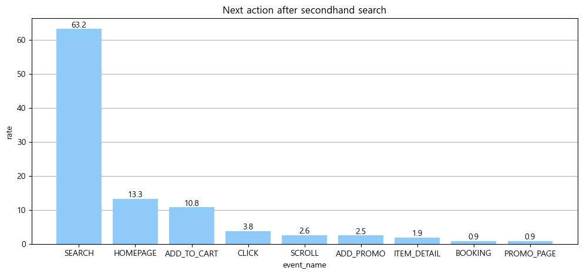
       
<중고상품 검색 후 다음 행동>

    </td>
    <td> 
        
       
<중고상품 검색 후 검색 키워드>

    </td>  
   </tr>
</table>  

* 중고상품의 경우가 전체 등록 상품(44,424개 중 17280개)의 39%임에도 불구하고, 중고 상품을 구매자는 꾸준히 증가하는 추세였지만 2022년도에 하락.

<table>
  <tr>
    <td>
      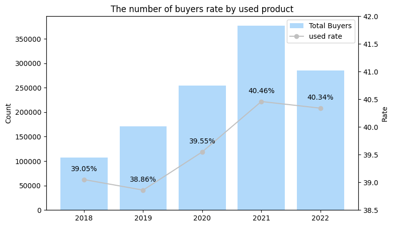
       
<전체 구매자 수(막대), 중고상품 구매자 비율(선)>

    </td>
    <td> 
      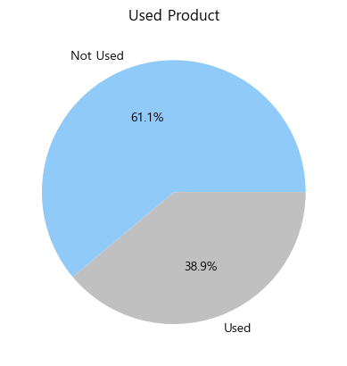  
       
<등록된 상품 중 상품별 비중> 

    </td>  
   </tr>
</table>  
 

 

3. 프로모션의 개선 필요
<table>
  <tr>
    <td>
      
       
<프로모션 사용 비율>

          
현 이커머스 플랫폼에서 프로모션을 사용하지 않는 경우가 전체 구매자의 61.7%

    </td>  
   </tr>
  <tr>
 <td>
   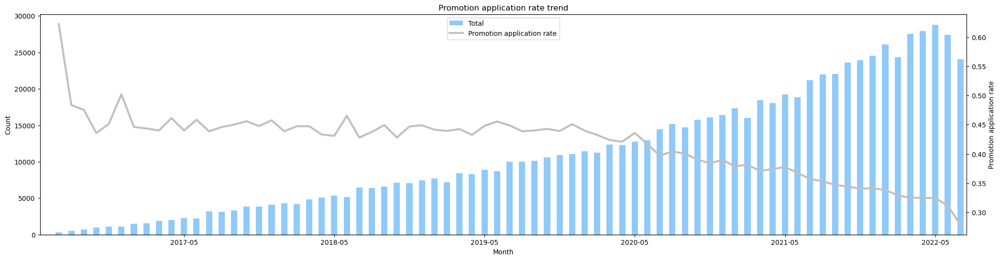
    
<월별 프로모션 적용 여부에 따른 전체 경우의 수(바), 프로모션 사용률<라인)>

    
2022년 6월과 7월의 고객 프로모션 사용률 감소

    
LIBURDONG, WEEKENDMANTAP, WEEKENDSERU 프로모션은 토요일, 일요일 전용 프로모션.

    
2020년 ~ 2022년 기준 프로모션이 진행되지 않는 날은 없음

 </td>  
</tr>
<tr>
 <td>
   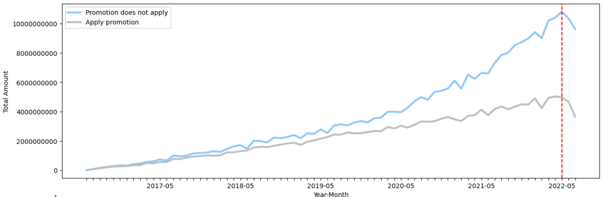
    
<날짜별 프로모션 적용 여부에 따른 매출>

    
프로모션을 적용한 경우와 아닌 경우의 매출 격차가 점점 증가.

    
매년 매출이 증가하다가 2022년 6월에서 7월까지의 가장 많은 매출 감소가 보임

 </td>  
</tr>
<tr>
 <td>
   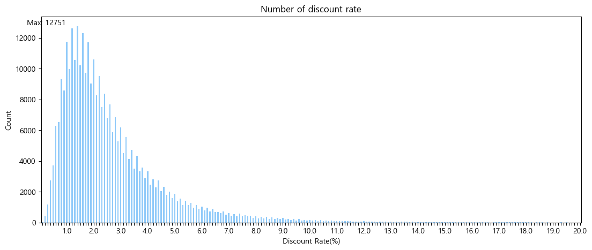
    
<프로모션 비율별 개수>

    
프로모션 할인율은 최소 0.1%부터 최대 54.6%까지 존재

    
평균적으로는 2.7%의 할인율 유지

 </td>  
</tr>
</table> 

* 인도네시아 이커머스 플랫폼 쇼피
   * 9월 9일, 10월 10일 등과 같은 기억하기 쉬운 날짜에만 특정 상품을 파격적으로 할인하는 행사를 매달 개최함. 특정 날짜에만 프로모션을 진행하는 점이 소비자들에게 해당 날짜에는 쇼피를 이용해야 한다는 인식을 각인시킴
* 인도네시아 전자상거래 토코피디아
   * 인도네시아의 월급날이 일반적으로 월말에 있다는 점을 착안해, 월급날 기간인 월말에 인도네시아 쇼핑 기간 캠페인을 매달 개최함. 해당 할인 기간에 토코피디아의 매출은 다른 날 대비 평균 3배 증가함

          
 

2.4 결과  
* **액션 도출 1 _ 일회성고객**
   * 의미 있는 프로모션 제공
      * 일회성 고객들의 객단가가 가장 낮은 7월에 프로모션을 제공
         * 매년 7월 이슬람 새해가 있는 것과 일회성 고객들의 Dress-Kondangan(이슬람 전통복장)의  검색 비율이 높음을 고려하여 새해 프로모션 제공
      * 주말 프로모션 제공
         * 일, 월, 토 순으로 구매를 많이 하는 것으로 보아 주말에 구매하는 경향 파악
         * 재구매율이 높은 16~30일 이내로 다시 돌아오지 않는 경우 주말 프로모션을 제공
   * 모바일 푸시 알람 제공
      *  해당 이커머스 플랫폼의 모바일 사용자가 90%이기 때문에 이점을 활용해서 일회성 고객들에게 현 플랫폼으로 돌아올 수 있는 푸시 알람을 제공
* **액션 도출 2 _ 중고 상품**
   * 중고 상품 카테고리화
      *  검색어 키워드에 중고가 많은 것으로 보아 중고상품을 검색해야만 중고상품을 찾을 수 있는 것으로 보임. 따라서 중고상품 여부를 카테고리화하고, 그 안에 세부 카테고리별(의류,액세서리 등)로 선택 가능하도록 제공
   *  중고 상품 개수 증대
      *  소비자들의 중고상품에 대한 관심은 높지만 상품 전체 중 39%가 중고상품이므로, 그 개수를 늘려 소비자들이 현 플랫폼에서 폭넓은 선택을 할 수 있도록 개수를 증가시킴 
* **액션 도출 3 _ 프로모션**
   * 프로모션에 대한 인식 조사
      * 고객들이 프로모션을 어떻게 인식하는지, 사용하지 않는 이유에 대해 조사할 필요가 있고, 프로모션이 매일 진행되고 있음에도 불구하고 프로모션의 혜택이 고객에게 충분히 가치 있는 것으로 인식되지 않는 것으로 보임.
      * 쇼피와 토코피디아처럼 매출 증가 사례처럼 프로모션은 매출에 영향을 주는 중요한 요소이기 때문에 개선이 필요해 보임.
      * 추가로 특정 기간에만 프로모션을 진행하여 해당 날짜에는 해당 이커머스 플랫폼을 이용해야 한다는 인식을  각인시킬 필요가 있음
   * 할인율 범위 증대
      *  프로모션을 통한 금액 할인 범위는 235루피아부터 24,519루피아 이내
      *  현 이커머스 플랫폼 평균 할인율 2.7% 그러나 연말 쇼핑 시즌에는 온라인 쇼핑물 평균 할인율 약 21%
      *  타 이커머스 플랫폼과 비교했을 때 턱없이 낮은 할인율을 가지고 있기 때문에 할인율 범위를 넓힘
   * 타켓층을 선정하여 제공
      * 평균 이탈률이 가장 높은 20대 중심
      * 40,50대는 전체 고객의 5%밖에 되지 않으므로 20대를 중점으로 프로모션을 진행
      

 

2.5 이탈 예측 모델
* 이탈 기준 : 재방문까지의 기간이 15을 넘는 경우
   * 활성 고객 중 첫 방문까지의 시간을 보았을때, 활성 고객은 가입 후 15일 이내 모두 접속.
   * 이탈 모형 설계 시 재발문까지 기간이 15일을 기준으로 그 이후에는 휴면 아이디처럼 이탈을 했다고 정하는 것이 좋아보임.
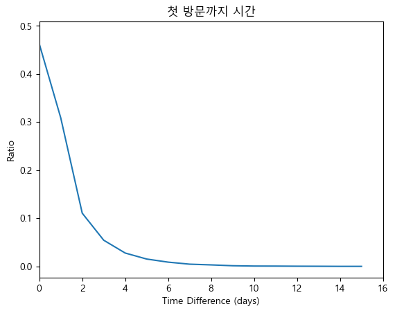

* 타켓 비율
   * 타켓은 이탈한 고객 약 10%, 이탈하지 않은 고객 약 90%.
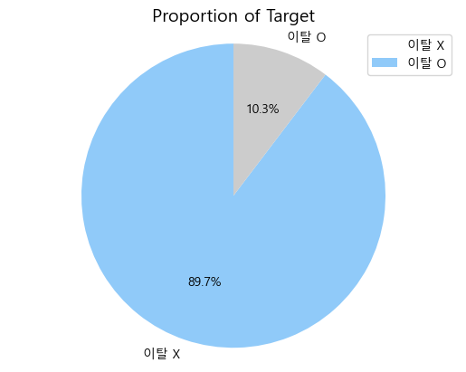

* 모델에 사용한 컬럼
   * 타켓과 가장 높은 상관계수를 가지는 것은 배송 제한 날짜.
   * 해당 10개의 피처를 모두 사용.
   * 제외한 피처 : diff(타켓을 생성한 컬럼),  유저들 총 세션 수(유저의 그룹화에 사용 예정)
   * 컬럼 설명
     |Feature|이름|선정이유|
     |:---:|:---:|---|
      |PAGE_VIEW|	페이지 뷰	|고객이 사이트에서 머무르는 시간과 관련|
      |SEARCH_COUNT|	세션의 이벤트 수(검색)	|고객이 상품을 탐색하고 구매결정을 내리는 데 어떤 노력을 했는지 확인|
      |ITEM_DETAIL_COUNT|	세션의 이벤트 수(상품 세부정보)	|고객이 상품을 탐색하고 구매결정을 내리는 데 어떤 노력을 했는지 확인|
      |ADD_PROMO_COUNT|	세션의 이벤트 수(이벤트)|	고객이 상품을 탐색하고 구매결정을 내리는 데 어떤 노력을 했는지 확인|
      |ADD_TO_CART_COUNT	|세션의 이벤트 수(장바구니)	|고객이 상품을 탐색하고 구매결정을 내리는 데 어떤 노력을 했는지 확인|
      |BOOKING_COUNT|	세션의 이벤트 수(결제)	|고객이 상품을 탐색하고 구매결정을 내리는 데 어떤 노력을 했는지 확인|
      |total_amount|	구매 금액	|가격은 고객이 구매 가능한 예산 범위 내에서 결정을 내릴 때 중요한 요소|
      |total_promo|	프로모션 비용	|고객이 방문할 때 프로모션이 주는 영향을 확인할 수 있는 요소|
      |shipment_fee|	배송비	|고객이 구매를 결정하고 결제에 영향을 줄 수 있는 요소|
      |limit_ship	|배송 제한 날짜	|고객이 구매를 결정하고 결제에 영향을 줄 수 있는 요소|
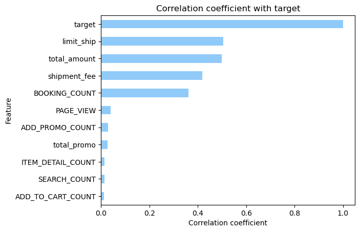

* 모델 사용
   * 5개의 모델 실험을 통해 아래와 같은 재현율을 얻음
   * logistic regression 모델은 4개의 모델보다 상대적으로 낮은 정확도를 보여 현 그래프 범위에서는 생략.
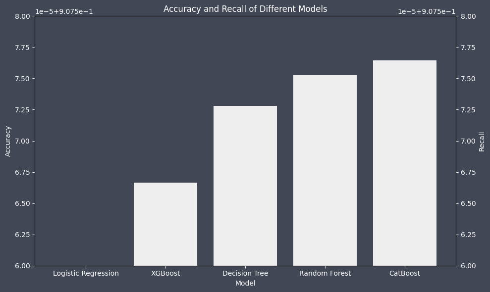

- 그중에서도 CatBoost모델 사용
   - 빠른 속도로 학습
   - 과적합을 방지
   - GPU를 지원하는 강점
   - 사용한 데이터셋에서 Type2 에러와 관련된 재현율 지표가 가장 높음
- 재현율을 사용한 이유 : 이탈한 고객을 이탈하지 않았다고 하는 경우, 실제 이탈 고객들이 존재하지 않는 것으로 판단하여 플랫폼 개선시 문제가 발생하는 오류가 그렇지 않은 경우보다 큼
- 정확도와 재현율이 같은 이유 : 클래스가 불균형해서 weighted = average 로 평가지표 계산과정을 진행. 그 과정을 진행하면서 정확도랑 재현율이 같아짐

 

* 모델 결과
   - 실제 타겟 비율 : 10.34% | 예측 타겟 비율: 12.41%
   - 마지막 세션 이후 15일 안에 접속 안하는 유저의 비율은 78.39%로 예측
   - 이탈 가능성은 평균 48.18%로 예측
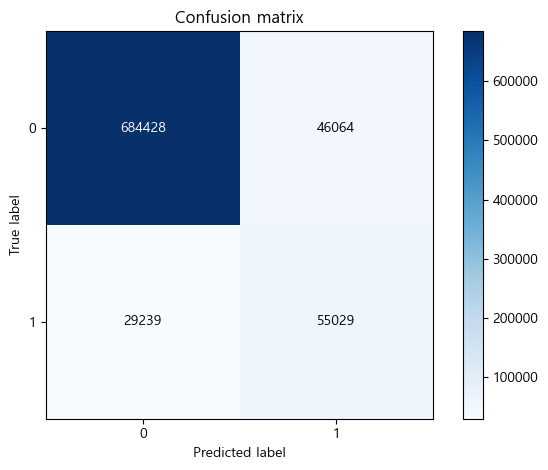

 

#### 3. 한계점 및 개선사항
* 한계점
   - 구매를 하지 않은 고객에 대한 세션 정보를 알 수 없다는 점에서의 분석 한계
   - 타 이커머스의 데이터를 얻을 수 없어 정확한 데이터의 비교가 불가능
* 개선사항
   - 전체 고객의 성향이 모두 다르기 때문에 RFM, 클러스터링 등으로 고객을 세분화하지 않은 점
   - 구매전환율과 체류시간에 따른 추가 분석 필요

